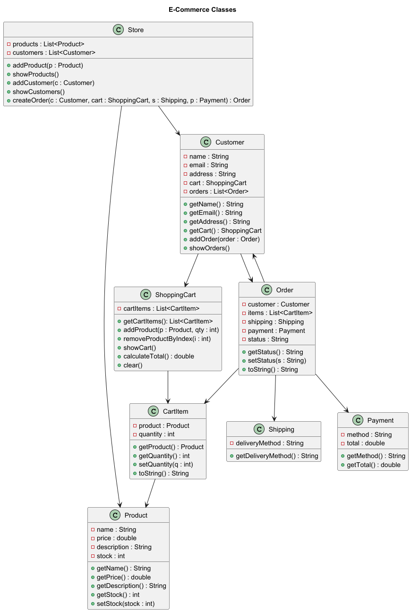
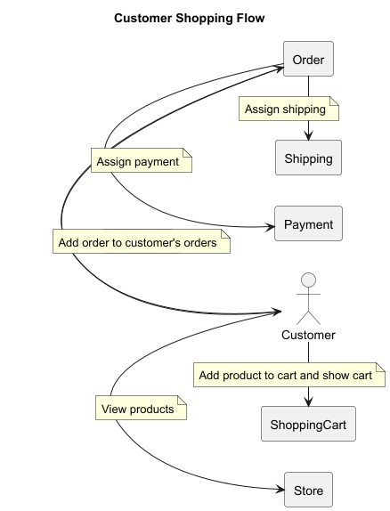

# 🛒 E-Commerce System (Java OOP Exercise)

This project is a simple **console-based e-commerce system** written in Java.  
It is designed as an **object-oriented programming (OOP) exercise** using composition.

---

## ✨ Features
- Show product catalog
- Add new customers
- List all customers
- Shop as a customer:
    - Add products to cart
    - Remove products from cart
    - Show cart contents
    - Place orders
    - View customers past orders
- Handle payment and shipping for orders

---

## Classes Overview

### `Store`
- Holds a list of `Product`s and `Customer`s
- Handles adding products, showing products, adding customers, and creating orders

### `Product`
- Represents a product in the store
- Attributes: `name`, `price`, `description`, `stock`

### `Customer`
- Represents a customer
- Attributes: `name`, `email`, `address`
- Has a `ShoppingCart` and a list of `Orders`

### `ShoppingCart`
- Contains list of `CartItems`
- Can add/remove items, show cart contents, and calculate total price

### `CartItem`
- Represents a single item in the cart
- Attributes: `Product` and `quantity`

### `Order`
- Created from the customers shopping cart
- Contains `CartItems`, `Payment`, and `Shipping`

### `Shipping`
- Represents a shipping option
- Attributes: `deliveryMethod`

### `Payment`
- Represents payment information
- Attributes: `method` and `total`

### `Main`
- Console interface
- Handles user input with a text menu
- Calls methods from `Store` and related classes

---

## ▶️ How to Run
1. Open the project in **IntelliJ IDEA**
2. Run the `Main.java` file.
3. Use the console menu to interact with the system:
    - View products
    - Add or select customers
    - Shop as a customer
    - Place orders

---

## 📚 Learning Goals
- Practice **object-oriented design** with multiple classes
- Use **composition** (Customer “has a” ShoppingCart, Store “has” Products and Customers)
- Manage relationships between objects (Orders, CartItems, Payment, Shipping)
- Learn to write UML

---

### Class Diagram

### Customer Shopping Flow
